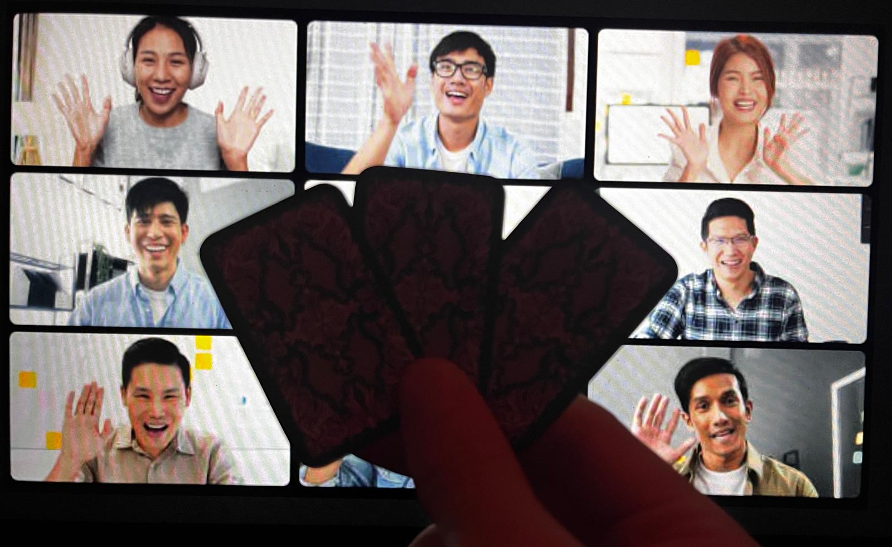
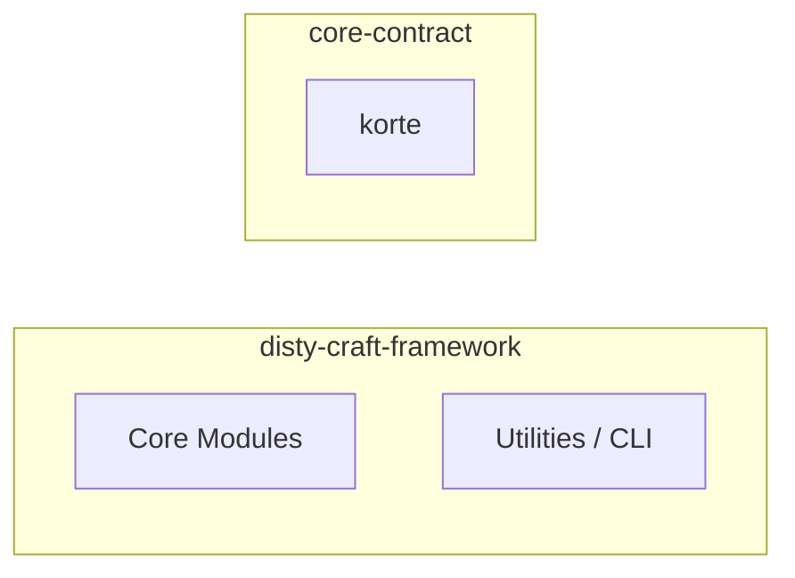
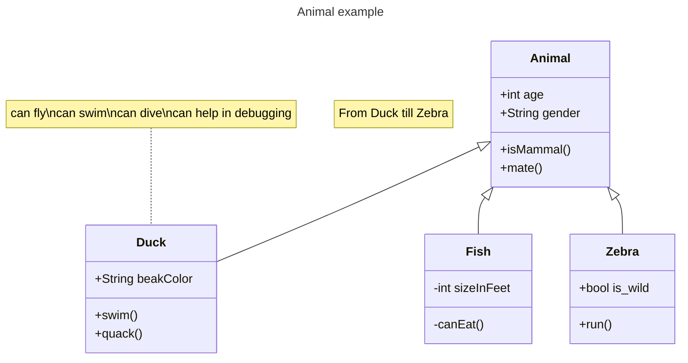
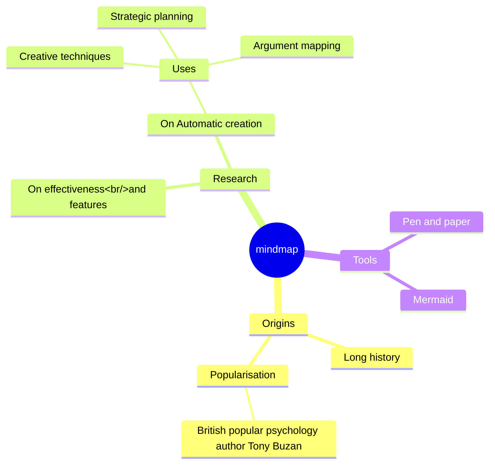
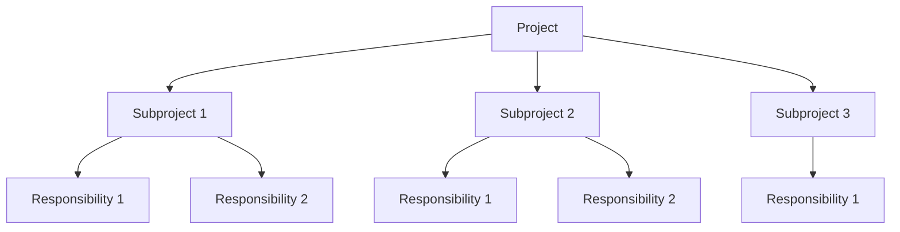

<!-- jump_to_middle -->
<!-- cmd: speaker_note: ⏳ 3:00 -->
<!-- cmd: speaker_note: --------------- -->
<!-- cmd: speaker_note: 󱥸 A bemutatót egy kedvcsináló bevezetővel fogom kezdeni, amely bemutatja az elképzelésemet. -->
Bevezető
===


<!-- include: parts/short_introduction.md -->

Képzeletindító
===


<!-- end_slide -->

<!-- jump_to_middle -->
☰ Áttekintés
===

<!-- cmd: speaker_note: 󱥸 A bemutató lényegi részét egy kérdés körbejárásával kezdeném, aztán mesélnék a projekt jelenlegi állapotáról, ezután szeretném, ha meghallgatnád a javaslataimat és kérdéseimet a fejlesztési irányok meghatározásáról.-->

<!-- cmd: speaker_note: 󱥸 Ezek ismeretében pedig szeretném, hogyha átbeszélnénk közösen az egészet (erre 20 percet szántam).-->

<!-- alignment: center -->

1. _Sikerültek_ a **kitűzött célok**?
2. Projekt állapota.
3. Válasszunk új célokat!

<!-- pause -->

\+ beszéljük át


<!-- no_footer -->

<!-- end_slide -->

<!-- jump_to_middle -->
📜 Kitűzött Célok
===

Mik voltak a célok?
---

<!-- column_layout: [1, 1] -->
<!-- column: 0 --> 

# Célok (nov.18 - dec.17)

- Működő _videóhívás_ 
- _QR Kód_ felismerés 󰢸
- _Játéküzenetek_ megjelenítése 
- _Játékállapot_ megjelenítése 


<!-- column: 1 --> 
<!-- pause -->

# Rejtett célok

- Architektúra tervezése 
- Kezdeti technológia stack kiválasztása 
- Munkafolyamatok kialakítása 

<!-- alignment: center -->
_projekt állapotánál visszatérek rájuk_

<!-- include: parts/accomplished_goals.md -->


<!-- end_slide -->
<!-- jump_to_middle -->
📜 Projekt Állapota
===

<!-- include: parts/project_state.md -->


<!-- end_slide -->
<!-- jump_to_middle -->
📜 Új célok
===

<!-- alignment: center -->
- Fontos teendők
- Ötletek
- Továbbfejlesztési lehetőségek

<!-- include: parts/new_goals.md -->


Kérdéseim
===
Kész leszek `ETDK`-ig? (május)

Vihetek hasonló bemutatót TDK-ra?

Van esélyem `OTDK`-ra?


<!-- end_slide -->
Beszélgessünk
===

<!-- column_layout: [1] -->
<!-- column: 0 -->
```bash +exec_replace +no_background
toilet -f mono12 -F gay "Beszéljük át" -w 200
```

<!-- pause -->
...még valami:
<!-- pause -->
>    ameddig beszélgetünk, becsüljük meg a terminál nyújtotta lehetőségeket

```bash +exec +acquire_terminal
ssh starwarstel.net
```

🙏 Köszönöm a figyelmet!
===

<!-- column_layout: [1, 1] -->
<!-- column: 0 -->
# Bemutató során felhasznált eszközök
- presenterm: md alapú bemutatókészítés (rust)
- figlet, toilet: ascii art (C)
- mermaid-ascii: mermaid-ascii render (go)
- asciinema: terminal közvetítés (rust)

- zellij: terminal emulator (rust)
- zoxide: okosabb cd (rust)
- yazi: fájlkezelő (rust)

- git: az egész bemutató verziókövetve készült
- devenv: környezet kezelése (nix)

<!-- column: 1 -->
## Potencionálisan felhasznált eszközök
- lazygit
- nixvim
- direnv + fd + google/keep-sorted

draft
===


<span style="color: #4f3638;">**\*videóhívás** ➤ QR Kód ➤ Játéküzenetek ➤ Játékállapot</span> 

draft
===
```bash +exec_replace +no_background
curl -s https://mermaid-ascii.art -d mermaid="graph LR\nABC --> DEF"
```

draft
===

p

draft
===



draft
---
```bash +exec
echo $PWD
```

draft
===


draft
---

