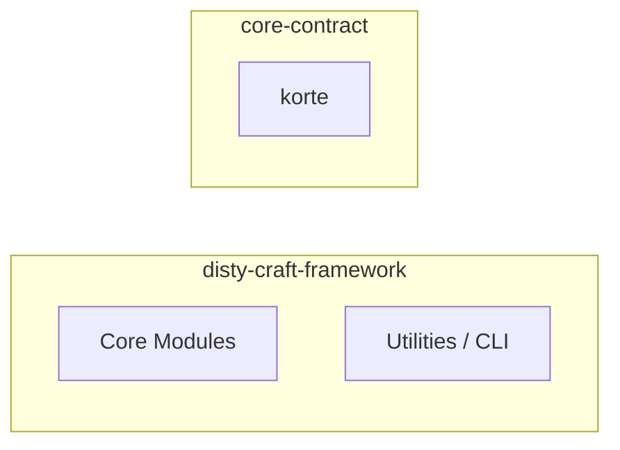
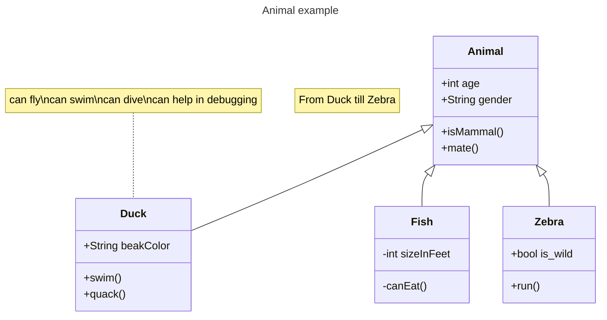

<!-- include: parts/short_description.md -->

<!-- end_slide -->
<!-- jump_to_middle -->
Áttekintés
===

<!-- alignment: center -->

1. _Sikerültek_ a **kitűzött célok**?
2. Projekt állapota.
3. Válasszunk új célokat!

<!-- pause -->

\+ beszéljük át
<!-- no_footer -->

<!-- end_slide -->
<!-- jump_to_middle -->
Kitűzött Célok
===

Mik voltak a célok?
---

<!-- column_layout: [1, 1] -->
<!-- column: 0 --> 

# Célok (nov.18 - dec.17)

- Működő _videóhívás_ 
- _QR Kód_ felismerés 󰢸
- _Játéküzenetek_ megjelenítése 
- _Játékállapot_ megjelenítése 


<!-- column: 1 --> 
<!-- pause -->

# Rejtett célok

- Architektúra tervezése 
- Kezdeti technológia stack kiválasztása 
- Munkafolyamatok kialakítása 

<!-- alignment: center -->
_projekt állapotánál visszatérek rájuk_

<!-- include: parts/accomplished_goals.md -->


<!-- end_slide -->
<!-- jump_to_middle -->
Projekt Állapota
===

<!-- include: parts/project_state.md -->


<!-- end_slide -->
<!-- jump_to_middle -->
Új célok
===

<!-- alignment: center -->
- Fontos teendők
- Ötletek
- Továbbfejlesztési lehetőségek

<!-- include: parts/new_goals.md -->


<!-- end_slide -->
<!-- jump_to_middle -->
Beszélgessünk
===

<!-- pause -->
...még valami:
<!-- pause -->
>    ameddig beszélgetünk, becsüljük meg a terminál nyújtotta lehetőségeket

```bash +exec +acquire_terminal
ssh starwarstel.net
```

Köszönöm a figyelmet!
===
# Bemutató során felhasznált eszközök
- presenterm: md alapú bemutatókészítés (rust)
- figlet, toilet: ascii art (C)
- asciinema: terminal közvetítés (rust)

- zellij: terminal emulator (rust)
- zoxide: okosabb cd (rust)
- yazi: fájlkezelő (rust)

- git: mentések
- devenv: környezet kezelése (nix)

draft
===


<span style="color: #4f3638;">**\*videóhívás** ➤ QR Kód ➤ Játéküzenetek ➤ Játékállapot</span> 

draft
===
```bash +exec_replace +no_background
curl -s https://mermaid-ascii.art -d mermaid="graph LR\nABC --> DEF"
```

draft
===

p

draft
===



draft
---
```bash +exec
echo $PWD
```